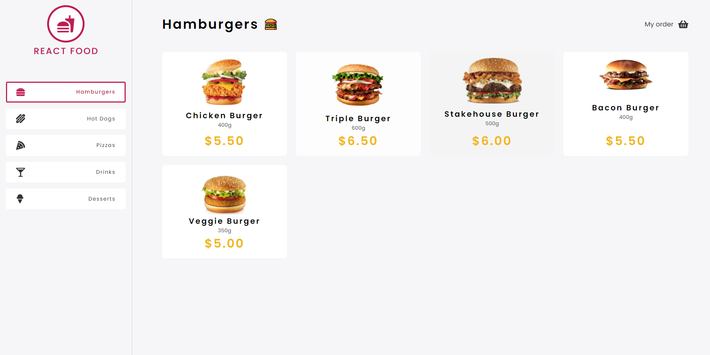
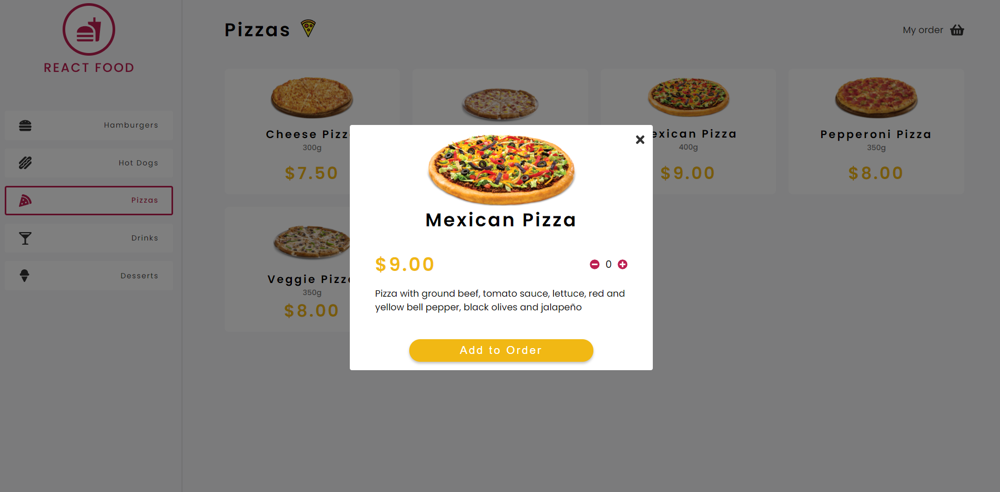
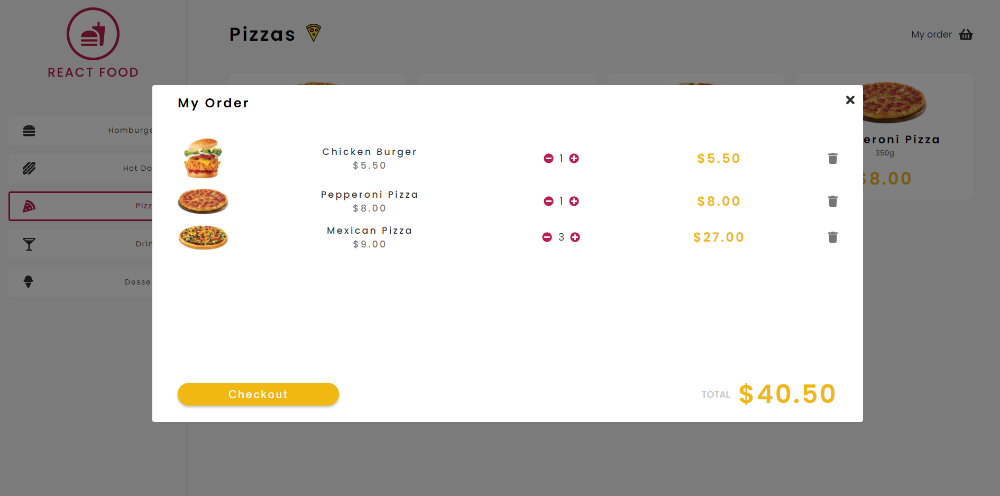

# React Food

### Description
This is a small React JS project of a food e-commerce which uses a fake API to get the data from.

### What I used:
* React JS
* Typescript
* React-Modal
* React-Toastify
* Styled-Components
* Axios
* MirageJS
